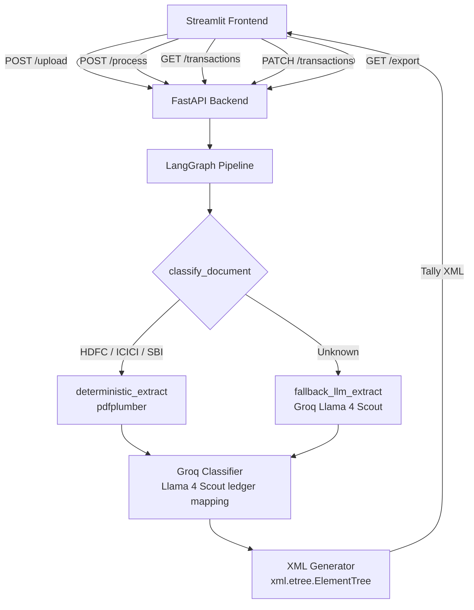

# Design Document

## Overview

The Bank Statement Tally Converter is a web application that accepts Indian bank statement PDFs and produces Tally ERP 9 / Tally Prime-compatible XML voucher files. The core flow is:

1. User uploads a PDF via the Streamlit frontend
2. FastAPI backend validates and stores the file, returning a `job_id`
3. A LangGraph pipeline classifies the document and extracts transactions (deterministic for known banks, Groq LLM fallback for others)
4. A Groq LLM classifier maps each narration to a Tally ledger name
5. User reviews and corrects ledger assignments in the UI
6. XML is generated and downloaded

The MVP is intentionally minimal: no vector stores, no observability platforms, no queues. All state is held in-memory per job.

---

## Architecture



### Key Design Decisions

- **In-memory job store**: Jobs are stored in a Python dict keyed by `job_id`. Sufficient for MVP; swap for Redis/DB later.
- **LangGraph for extraction**: Provides a clean state machine with explicit routing, making it easy to add new bank parsers as nodes.
- **LLM directly for classification**: No RAG/vector store. The Groq LLM (`meta-llama/llama-4-scout-17b-16e-instruct`) receives the narration plus a hardcoded list of common Tally ledger names as context. Simple and effective for MVP.
- **Streamlit for frontend**: Minimal setup, Python-native, sufficient for the review-and-download workflow.

---

## Components and Interfaces

### FastAPI Backend (`app/main.py`)

| Endpoint | Method | Description |
|---|---|---|
| `/upload` | POST | Accept PDF, validate, return `job_id` |
| `/process/{job_id}` | POST | Run extraction + classification pipeline |
| `/transactions/{job_id}` | GET | Return transactions with ledger suggestions |
| `/transactions/{job_id}/{tx_id}` | PATCH | Update `assigned_ledger` for one transaction |
| `/export/{job_id}` | GET | Generate and return Tally XML file |
| `/health` | GET | Return app status |

### LangGraph Pipeline (`app/pipeline/graph.py`)

State machine nodes:

- `classify_document`: Reads PDF text, identifies bank by header keywords (HDFC/ICICI/SBI). Sets `bank_type` in state.
- `deterministic_extract`: Calls the appropriate bank parser (pdfplumber). Sets `transactions` in state.
- `fallback_llm_extract`: Sends page text to Groq (`meta-llama/llama-4-scout-17b-16e-instruct`) with a structured prompt. Parses JSON response into transactions.

### Bank Parsers (`app/pipeline/parsers/`)

One module per bank: `hdfc.py`, `icici.py`, `sbi.py`. Each exposes a `parse(pdf_path) -> list[Transaction]` function. Column layouts are defined as constants within each module.

### Groq Classifier (`app/classifier.py`)

Single function: `classify_transactions(transactions: list[Transaction]) -> list[Transaction]`

Uses the Groq Python SDK directly (`from groq import Groq`) with model `meta-llama/llama-4-scout-17b-16e-instruct`. Builds a prompt with:
- The narration text
- A predefined list of ~30 common Tally ledger names (e.g., "Sales", "Purchases", "Bank Charges", "Salary", "Rent", "Meals & Entertainment")

Returns the same list with `assigned_ledger` populated.

### XML Generator (`app/xml_generator.py`)

Single function: `generate_tally_xml(transactions: list[Transaction], bank_ledger_name: str) -> str`

Builds the XML tree using `xml.etree.ElementTree` and returns the serialized string.

### Streamlit Frontend (`frontend/app.py`)

Three-step UI:
1. Upload PDF → trigger `/upload` and `/process`
2. Review table of transactions with editable ledger column → PATCH on change
3. Download XML button → calls `/export`

---

## Data Models

All models defined in `app/models.py` using Pydantic v2.

```python
from decimal import Decimal
from enum import Enum
from uuid import UUID
from datetime import datetime
from pydantic import BaseModel, field_validator

class JobStatus(str, Enum):
    pending = "pending"
    extracting = "extracting"
    classifying = "classifying"
    ready = "ready"
    failed = "failed"

class VoucherType(str, Enum):
    Receipt = "Receipt"
    Payment = "Payment"
    Contra = "Contra"

class Transaction(BaseModel):
    id: str  # UUID string, assigned at creation
    date: str  # YYYYMMDD
    narration: str
    reference_number: str | None = None
    withdrawal: Decimal
    deposit: Decimal
    closing_balance: Decimal
    assigned_ledger: str | None = None
    parse_error: bool = False

    @field_validator("withdrawal", "deposit", "closing_balance")
    @classmethod
    def must_be_non_negative(cls, v):
        if v < 0:
            raise ValueError("Amount must be non-negative")
        return v

class ProcessingJob(BaseModel):
    job_id: UUID
    status: JobStatus = JobStatus.pending
    transactions: list[Transaction] = []
    created_at: datetime

class TallyVoucher(BaseModel):
    voucher_type: VoucherType
    date: str  # YYYYMMDD
    narration: str
    debit_ledger: str
    credit_ledger: str
    amount: Decimal
```

### Voucher Type Determination

| Condition | Voucher Type | Debit | Credit |
|---|---|---|---|
| `withdrawal > 0` and `deposit == 0` | Payment | assigned_ledger | bank ledger |
| `deposit > 0` and `withdrawal == 0` | Receipt | bank ledger | assigned_ledger |
| `withdrawal > 0` and `deposit > 0` | Contra | assigned_ledger | bank ledger |

### Tally XML Structure

```xml
<ENVELOPE>
  <HEADER>
    <TALLYREQUEST>Import Data</TALLYREQUEST>
  </HEADER>
  <BODY>
    <IMPORTDATA>
      <REQUESTDESC>
        <REPORTNAME>Vouchers</REPORTNAME>
      </REQUESTDESC>
      <REQUESTDATA>
        <TALLYMESSAGE xmlns:UDF="TallyUDF">
          <VOUCHER VCHTYPE="Payment" ACTION="Create">
            <DATE>20240101</DATE>
            <NARRATION>UPI/Zomato/123456</NARRATION>
            <VOUCHERTYPENAME>Payment</VOUCHERTYPENAME>
            <LEDGERENTRIES.LIST>
              <LEDGERNAME>Meals &amp; Entertainment</LEDGERNAME>
              <ISDEEMEDPOSITIVE>Yes</ISDEEMEDPOSITIVE>
              <AMOUNT>-500.00</AMOUNT>
            </LEDGERENTRIES.LIST>
            <LEDGERENTRIES.LIST>
              <LEDGERNAME>HDFC Bank</LEDGERNAME>
              <ISDEEMEDPOSITIVE>No</ISDEEMEDPOSITIVE>
              <AMOUNT>500.00</AMOUNT>
            </LEDGERENTRIES.LIST>
          </VOUCHER>
        </TALLYMESSAGE>
      </REQUESTDATA>
    </IMPORTDATA>
  </BODY>
</ENVELOPE>
```

`ISDEEMEDPOSITIVE` rules:
- Payment: debit entry = "Yes", credit entry = "No"
- Receipt: debit entry = "Yes", credit entry = "No"
- Contra: debit entry = "Yes", credit entry = "No"

---

## Correctness Properties

*A property is a characteristic or behavior that should hold true across all valid executions of a system — essentially, a formal statement about what the system should do. Properties serve as the bridge between human-readable specifications and machine-verifiable correctness guarantees.*

### Property 1: Valid PDF uploads always produce unique job IDs

*For any* two valid PDF uploads, the returned `job_id` values SHALL be distinct.

**Validates: Requirements 1.5**

---

### Property 2: Non-PDF files are always rejected

*For any* file whose content is not a valid PDF (wrong MIME type or missing PDF header bytes), the upload endpoint SHALL reject it with a non-2xx response.

**Validates: Requirements 1.2, 1.3**

---

### Property 3: Extracted transactions always contain required fields

*For any* bank statement PDF processed through the deterministic path, every extracted `Transaction` SHALL have a non-empty `date`, non-empty `narration`, and non-negative `withdrawal` and `deposit` values.

**Validates: Requirements 2.2, 2.5**

---

### Property 4: Date normalization is consistent

*For any* date string in a supported input format (e.g., `DD/MM/YYYY`, `DD-MM-YYYY`, `DD MMM YYYY`), the normalized output SHALL be a valid 8-character string matching `YYYYMMDD`.

**Validates: Requirements 2.3**

---

### Property 5: Numeric field cleaning preserves value

*For any* numeric string containing commas or currency symbols (e.g., `"1,23,456.78"`, `"₹500.00"`), stripping formatting and parsing SHALL produce the same `Decimal` value as the unformatted number.

**Validates: Requirements 2.4**

---

### Property 6: LLM-extracted transactions with invalid dates are flagged

*For any* transaction returned by the LLM fallback where the date field cannot be parsed into `YYYYMMDD`, the resulting `Transaction` object SHALL have `parse_error = True`.

**Validates: Requirements 3.3**

---

### Property 7: Negative amounts are always rejected by the data model

*For any* attempt to construct a `Transaction` with a negative `withdrawal`, `deposit`, or `closing_balance`, the Pydantic model SHALL raise a `ValidationError`.

**Validates: Requirements 5.3**

---

### Property 8: Classification populates all ledger assignments

*For any* list of `Transaction` objects passed through the classifier, every transaction in the returned list SHALL have a non-empty `assigned_ledger` string (assuming no LLM error).

**Validates: Requirements 6.1**

---

### Property 9: Job reaches ready status when all ledgers are assigned

*For any* `ProcessingJob` where every `Transaction` has a non-empty `assigned_ledger`, the job `status` SHALL be `ready`.

**Validates: Requirements 7.4**

---

### Property 10: Voucher type is determined correctly by transaction amounts

*For any* `Transaction`, the generated `TallyVoucher` type SHALL satisfy:
- `withdrawal > 0` and `deposit == 0` → `Payment`
- `deposit > 0` and `withdrawal == 0` → `Receipt`
- `withdrawal > 0` and `deposit > 0` → `Contra`

**Validates: Requirements 8.2, 8.3, 8.4**

---

### Property 11: Generated XML conforms to Tally TDL hierarchy

*For any* non-empty list of transactions, the generated XML string SHALL be parseable and SHALL contain the element path `ENVELOPE > BODY > IMPORTDATA > REQUESTDATA > TALLYMESSAGE > VOUCHER` with correct `LEDGERENTRIES.LIST` children including `ISDEEMEDPOSITIVE`.

**Validates: Requirements 8.1, 8.5**

---

### Property 12: XML generation round-trip

*For any* valid list of `Transaction` objects with assigned ledgers, parsing the generated Tally XML back into voucher records and re-generating XML SHALL produce an identical XML document.

**Validates: Requirements 8.8, 11.5**

---

## Error Handling

| Scenario | HTTP Status | Behavior |
|---|---|---|
| Non-PDF upload | 422 | Return descriptive error message |
| PDF > 50 MB | 413 | Return size limit error message |
| Job ID not found | 404 | Return "job not found" |
| Export on non-ready job | 409 | Return "job not ready for export" |
| PATCH with empty ledger | 422 | Return validation error |
| LLM API failure during extraction | 500 | Mark job as `failed`, return error detail |
| LLM API failure during classification | 500 | Mark job as `failed`, return error detail |
| Missing env var at startup | — | Raise `ConfigurationError`, exit non-zero |
| Transaction with unparseable date | — | Set `parse_error = True`, include in results |

LLM failures during extraction or classification are fatal to the job (status → `failed`) since there is no fallback. The user can re-upload and retry.

---

## Testing Strategy

### Unit Tests (pytest)

Focus on specific examples, edge cases, and error conditions:

- `test_xml_generator.py`: One test per voucher type (Receipt, Payment, Contra) verifying correct element names, ledger assignments, and `ISDEEMEDPOSITIVE` values. One test verifying the full XML hierarchy.
- `test_parsers.py`: One test per bank (HDFC, ICICI, SBI) using fixture PDF files in `tests/fixtures/`. Verify field extraction and date/amount normalization.
- `test_models.py`: Verify `Transaction` rejects negative amounts, accepts zero amounts, and sets `parse_error` default to False.
- `test_api.py`: Verify upload endpoint rejects non-PDFs (422) and oversized files (413). Verify export returns 409 for non-ready jobs.

### Property-Based Tests (pytest + Hypothesis)

Each property test runs a minimum of 100 iterations. Tests are tagged with a comment referencing the design property.

```python
# Feature: bank-statement-tally-converter, Property 12: XML generation round-trip
@given(transactions=st.lists(transaction_strategy(), min_size=1))
@settings(max_examples=100)
def test_xml_roundtrip(transactions):
    xml_str = generate_tally_xml(transactions, bank_ledger_name="HDFC Bank")
    reparsed = parse_tally_xml(xml_str)
    regenerated = generate_tally_xml(reparsed, bank_ledger_name="HDFC Bank")
    assert xml_str == regenerated
```

Property tests to implement:

| Test | Property | Library Strategy |
|---|---|---|
| `test_unique_job_ids` | Property 1 | `st.binary()` for PDF bytes |
| `test_non_pdf_rejected` | Property 2 | `st.binary()` filtered to non-PDF headers |
| `test_date_normalization` | Property 4 | `st.dates()` formatted in various input styles |
| `test_numeric_cleaning` | Property 5 | `st.decimals()` formatted with commas/symbols |
| `test_negative_amount_rejected` | Property 7 | `st.decimals(max_value=-0.01)` |
| `test_voucher_type_selection` | Property 10 | `st.decimals(min_value=0)` for withdrawal/deposit pairs |
| `test_xml_hierarchy` | Property 11 | `st.lists(transaction_strategy())` |
| `test_xml_roundtrip` | Property 12 | `st.lists(transaction_strategy())` |

The `transaction_strategy()` composite strategy generates valid `Transaction` objects with non-negative amounts, valid YYYYMMDD dates, non-empty narrations, and non-empty assigned ledgers.
